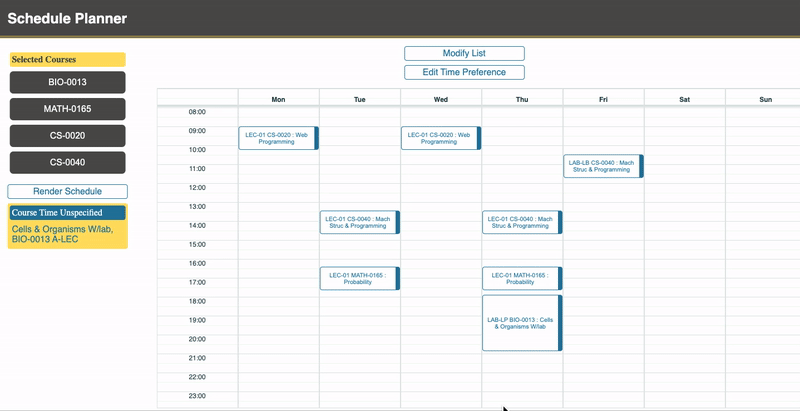

# Semester Schedule Generator with Tufts University Courses

# Overview
API that generates personalized semester schedules given a list of courses and user preferences with heuristic algorithms. Developed with Node JS, MongoDB, and Python. 

## Documentation
http://tufts-schedule-api.herokuapp.com/docs

